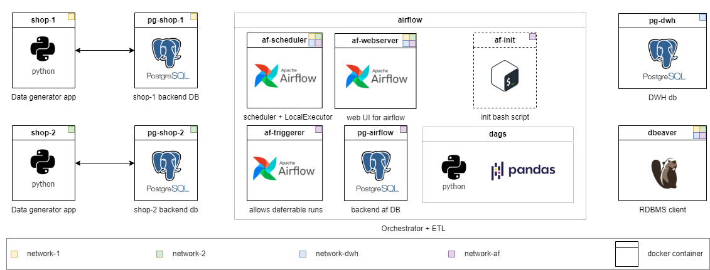
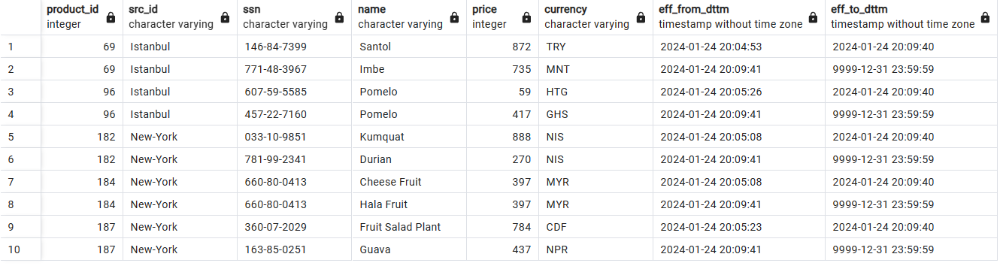
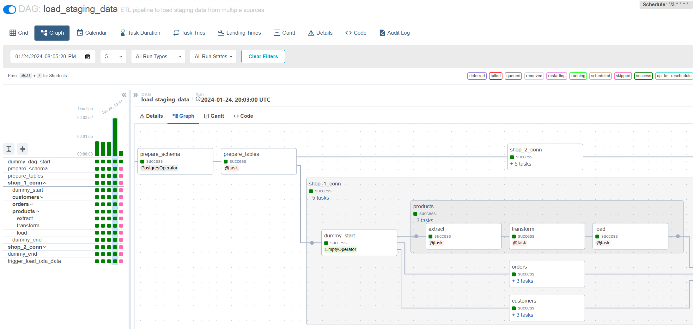
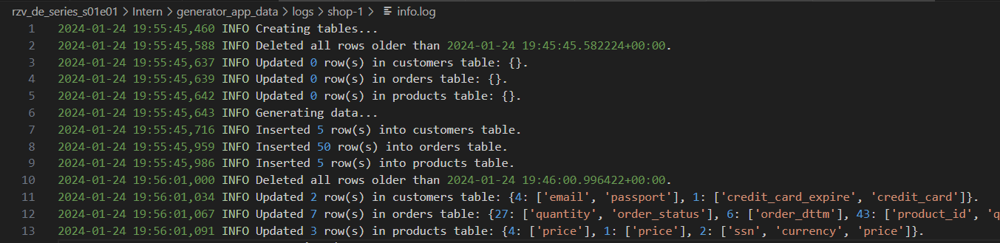
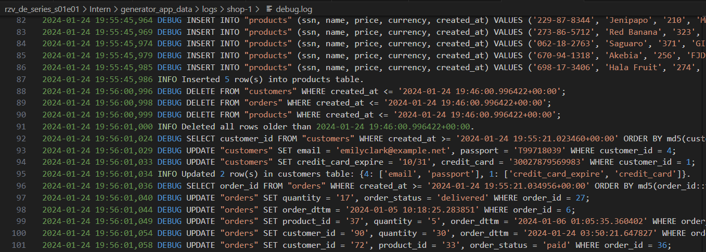
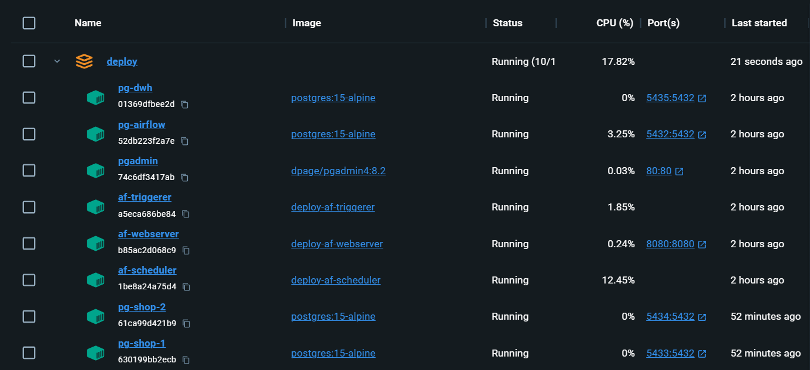

# rzv_de_series_s01e01

## 📽️ Welcome to the course!
Here is an open episode of the rzv Data engineering series training course. Choose which series you will turn on tonight - one that will distract you from life, or one that will give you the opportunity to learn skills and create!

The course is going in a self-paced format, the infrastructure is deployed locally in Docker containers. I expect that you will look for materials to answer your questions on your own and discuss them in the [general chat](https://t.me/rzv_de_series). A solution is applied to the task at the Middle level. The tasks are divided into different difficulty levels. Start with where you feel most comfortable and work your way up. The higher the grade, the more abstract the problem statement -- it’s just like in life.

The skills you acquire during the course can be transferred to work practice almost effortlessly. And, unlike most courses, here you work with “live” data that is generated in real time (in a simplified manner). By the end of the first season of the series, you will be able to experience data engineering problems in practice and write the solutions yourself.

The further along the course, the more modules will be attached following the “business development”:
* data collection from a local API service
* building data marts and BI dashboards
* ETL tool migration from Pandas to Spark
* integration of Data Quality tools
* a lot more

p.s. Check the translated readme.md versions in the root of main directories: [\[ru\] is available](README_ru.md).

## 🥱 TL;DR
1. Fork the repo and clone it to the pc/mac
2. Install docker desktop
3. Follow the steps in the [database connectivity and infrastracture setup](setup_instructions.md)
4. Choose G0_Trainee to run the code and see how it works. Get through grades from G1 to G3 to master data ingestion with Airflow

## 🎬 What's on TV today
This is the first episode covering the features of incremental loading through Apache Airflow. In the process of performing tasks at the Middle and Senior level, you will encounter many difficulties that exist in real work practice. At the same time, even Junior and Intern tasks will introduce you to new concepts and gradually prepare you for more complex tasks.

I encourage you to first try to solve the problem yourself, and then look at my version.

You will learn:
* incremental data loading using Airflow
* basic ETL via Pandas
* work with relational databases via SQL and Python
* setting up connections to sources in Airflow and dbeaver
* running applications in containers via Docker Compose

## 🎞️ Cast

* Python 3.12
* Postgres 15 (DWH)
* Pandas 2.1.4 (ETL)
* Apache Airflow 2.9.2(Orchestrator)
* dbeaver (DBMS client)
* Docker

## 👨🏻‍🦲 👦🏻 🧔🏻 Scenarios and grades
Each level has its own directory. With each level I reduce the amount of ready-to-run code and raise the task's complexity. The contents of the directories are slightly different, but the infrastructure is ready for use everywhere. Detailed tasks are described in `README.md` of each grade. Choose yours and feel free to lower the level if necessary.

**Trainee**: All code has already been implemented for the middle grade problem. Just launch and explore it. Also you can find notes explaining why I've implemented the solution this way.

**Intern**: Extend the existing configuration so that the written DAG starts loading data from a new source and new tables. Write a simple dag for working with the file system to clean-up temporary files using BashOperator.

**Junior**: Write incremental loading without taking into account historical storage. The data on the source is not updated.

**Middle**: Write an incremental load into SCD2 tables. Please note that the data may be updated at the source.

**Senior**: Assignment as for Middle + setup Write-Audit-Publish pattern to ensure data quality and conduct load testing of the written solution.

## Gallery
Historical data storage with SCD2:

Incremental loading via Airflow:

Generator logs with varying levels of detail:

Completely local infrastructure with everything you need:

## 🚧 Identified but not yet resolved issues
* CloudBeaver loses authentication, go first on `localhost:80/#/admin`, log in, then go back to the main page `localhost/#/`

## 🎉 Resolved issues
* [1.1.1] Moved logs from bind mount to volume which should fix "dags aren't shown in the UI" for some users. Also increased memory reservation for airflow to 2..3 GB.
* [1.1.0] Episode requires 5-7 GB RAM for simultaneous operation of the entire infrastructure on Win and Mac (docker desktop is heavy + many services run). [It is recommended to increase virtual RAM/swap file](https://www.windowscentral.com/how-change-virtual-memory-size-windows-10).
* [1.1.0] Each time after `docker compose up` airflow is re-initialized. The dags are saved, but `Connections` and `Variables` need to be filled-in again.

## 👷🏻 About the author
Aleksei Razvodov, Data engineer with 5+ years of experience in the industry. I strive to convey my understanding of the work of a data engineer and help those who are developing along this path.

If this repository helped you and you liked it, give it a ⭐ and subscribe to the social networks.
* [Mentor](https://razvodov-mentorship-de.notion.site/About-me-and-mentorship_ru-06510bfd4bbd4dcba93c351df0ff4a0e)
* [Telegram channel author about Data Engineering](https://t.me/rzv_de)
* [LinkedIn author about Data Engineering](https://www.linkedin.com/in/razvodov-alexey/)
* [CV](https://docs.google.com/document/d/1tYi0s7yNsGl_Xts5CrHDegLvAtlHtz7jPSp074MfCyI/edit?usp=sharing)
* [Contact me](https://t.me/razvodov_de_mentor)

